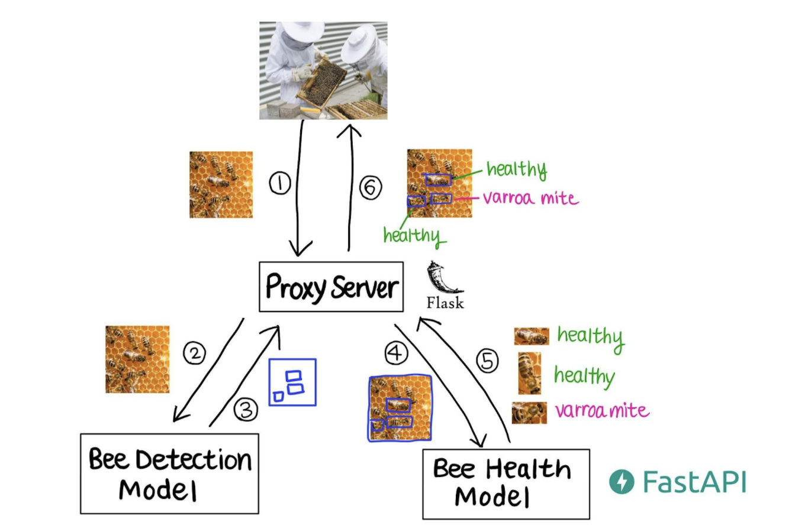

# Honeybee Health AI

Developed by Rachel Moon and Murad Khalilov.

## I. Overview
Honeybee Health AI is a machine learning based web application that predicts health of the honeybees from beehive images. Our web application first runs a pre-trained object detection model to detect individual bees from the hive image, and then runs a convolutional neural network model we trained to predict the health of an individual bee. We built our ML product as microservices and deployed our containerized services to Google Cloud Platform (GCP) Cloud Run.

You can visit our web application here: https://bee-proxy-server-7w6n2246cq-uk.a.run.app/

Click on the image below to watch the demo video of our web application:

## II. Machine Learning Models
### 1. Bee Detection Model
Bee detection model API: https://bee-detection-model-7w6n2246cq-uk.a.run.app/docs

To detect individual bees from a beehive image, we used a pre-trained object detection model called [MobileNet V2](https://tfhub.dev/google/openimages_v4/ssd/mobilenet_v2/1), which is published by Google and was trained on 14.7M bounding boxes from 1.74M images with 600 object classes including "bee."

### 2. Bee Health Model
Bee health model API: https://bee-health-model-7w6n2246cq-uk.a.run.app/docs

Our convolutional neural network model for predicting bee health has been trained on ~5000 single bee images with 5 target values: `healthy`, `varroa mites`, `ant problems`, `hive being robbed`, and `missing queen`. The [data](https://www.kaggle.com/jenny18/honey-bee-annotated-images) is from Kaggle and is in the form of images that have been cropped from a video file. Our bee health model achieves high predictive performance, with acccuracy of 0.97 and F1 score of 0.90 (as of Feb 2022). While our model performance is quite high, it is important to monitor and minimize false negative rates (falsely reporting a sick bee as healthy, which is very costly for bee farmers).

For more details on our bee health model implementation, check out `notebooks/bee_health_classification.ipynb`.

## III. Microservices Architecture
Honeybee Health AI consists of three microservices: **bee detection model server**, **bee health model server**, and **proxy server** to handle web requests.

Below is a diagram of how our microservices communicate via API to provide bee health predictions to honeybee farmers.

1. Honeybee farmer visits our website and submits a beehive image. 
2. Proxy server sends the beehive image to the bee detection model server. 
3. Bee detection model server detects individual bees from the beehive image and sends bounding box coordinates back to proxy server as JSON. 
4. Proxy server then sends beehive information and bounding box coordinate information of the detected bees to bee health model server.
5. Bee health model server predicts health for each cropped bee in the image, and sends back results to proxy server as JSON.
6. Proxy server processes the results and provides a health report to the honeybee farmers in HTML.

## IV. Tutorial
### 1. How to run servers locally (for development)
#### a. Model Servers (FastAPI)
1. Navigate to: 
`src/bee_detection_model` for bee detection model server, or 
`src/bee_health_model` for bee health model server.
 

2. In your local terminal, run: `./fastapi_run.sh`. 
> If you encounter errors such as...
> - permission denied: type `chmod +x fastapi_run.sh` to grant execute access and try again.
> - SavedModel file does not exist: follow steps [here](https://stackoverflow.com/questions/63078695/savedmodel-file-does-not-exist-when-using-tensorflow-hub). For mac, run `open $TMPDIR` in your terminal and remove `tfhub_modules` folder.

3. Now let's test our model APIs. Visit:
`localhost:8000/docs` for bee detection model, or 
`localhost:7000/docs` for bee health model.

#### b. Proxy Server (Flask)
1. Both model servers should be running (either locally or on the cloud) before running the proxy server!
 
2. Navigate to `src/proxy_server`. Open `.env` file and update `DETECTION_MODEL_URL` and `HEALTH_MODEL_URL` variables accordingly.
    If your model servers are running in your local computer, visit [here](https://www.whatismybrowser.com/detect/what-is-my-local-ip-address) to find your local IP address. In most cases, your local IP address starts with `192.168...`.
 
3. In your local terminal, run `./flask_run.sh`.
 
4. Visit `localhost:5000` to test and debug the web application!

### 2. How to build and run Docker containers locally (for development)

1. We need to build and run all three of our containerized microservices. First, navigate to `src/bee_detection_model` and type: `./docker_run.sh`. This bash script will:
    1. stop currently running Docker container if it already exists
    2. build new Docker image using Dockerfile
    3. create and run a Docker container using the built Docker image.
 
2. Navigate to `src/bee_health_model` and repeat step 1.
 
3. Navigate to `src/proxy_server`. Open `.env` file and update `DETECTION_MODEL_URL` and `HEALTH_MODEL_URL` variables accordingly. (If your model servers are running in your local computer, visit [here](https://www.whatismybrowser.com/detect/what-is-my-local-ip-address) to find your local IP address. In most cases, your local IP address starts with `192.168...`.) Then, repeat step 1 to build and run the containerized application.
 
3. To check whether Docker container is running properly (and to find out the name of the running container), type `docker ps`. If you see any error status, type `docker logs <NAME>` to fetch logs for the container. To inspect the insides of currently running container (aka navigate Docker container instance with CLI), type `docker exec -it <NAME> /bin/bash`.
 
4. Visit the following URLs to test your application running on your local computer:
`localhost:8000` - bee detection model server
`localhost:7000` - bee health model server
`localhost:5000` - proxy server.
 
5. When you are finished, type `docker stop <NAME>` for all three containers. Make sure to remove unused containers and images by typing `docker system prune`. These unused containers and images will take up lots of space if they are not removed.

### 3. How to deploy on GCP Cloud Run
1. First we need to build our Docker container images for both model servers with Cloud Build, and then register them to Google Container Registry (GCR). In the local terminal, navigate to `src/bee_detection_model` and run `gcloud builds submit --tag gcr.io/<PROJECT_ID>/<container-name>`.
 
2. Let's now deploy our Docker container services on GCP Cloud Run. 
    Visit GCP Cloud Run (`https://console.cloud.google.com/run?project=<PROJECT_ID>`) and click `Create Service`. Choose `Deploy one revision from an existing container image` and select the container image you uploaded. Select Region of your choice. In Autoscaling setting, set minimum number of instances to 1 to reduce cold starts. In Authentication setting, click on `Allow unauthenticated invocations`. In Container setting, set the container port (`8000` for detection model, `7000` for health model, `5000` for proxy server) and increase Memory and CPU capacity (bee detection model server especially requires high memory and CPU. Using 4-8GB memory and 2-4 CPU worked well). Wait for the server to spin up, and check that the server is healthy and serving traffic by visiting its URL!
 
3. In your local terminal, navigate to `src/bee_health_model`. Repeat steps 1 and 2 to deploy the bee health model server on the cloud.
 
4. Finally, let's deploy our web proxy server. Navigate to `src/proxy_server`. Make sure you update `.env` file by updating `DETECTION_MODEL_URL` and `HEALTH_MODEL_URL` variables with the new live URLs. Then, follow steps 1 and 2 to push proxy server Docker image to GCR and deploy the web app on GCP Cloud Run!